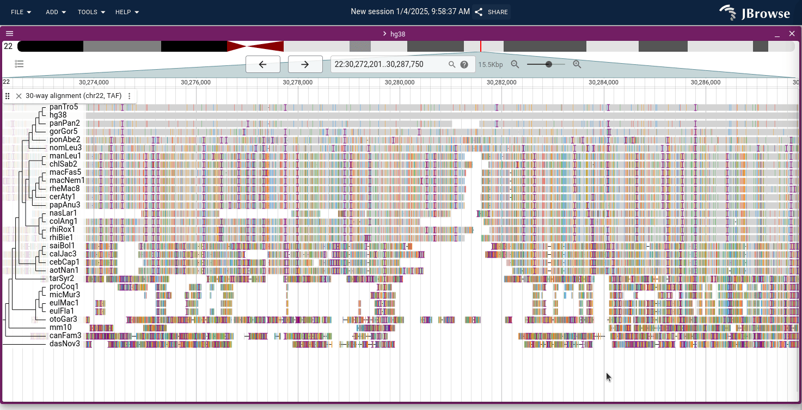
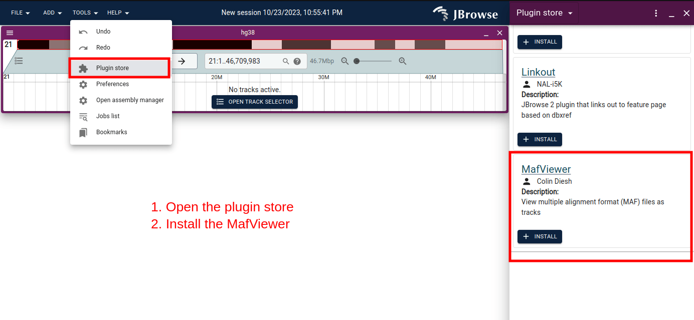
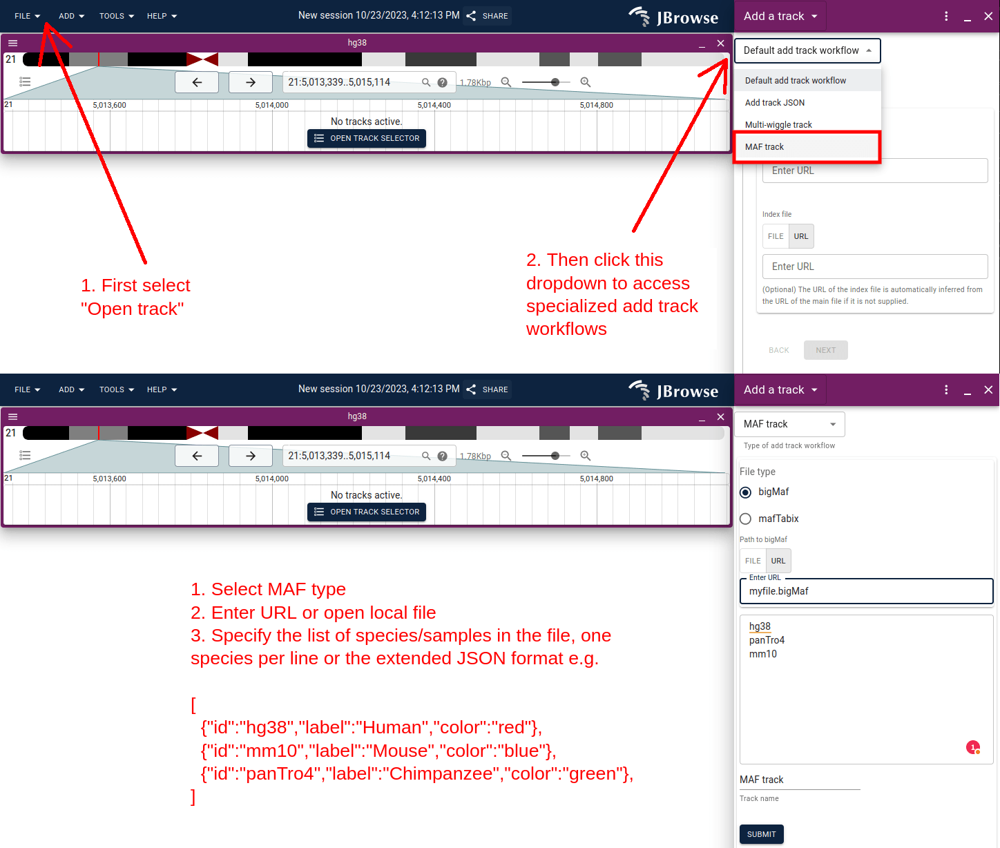

# jbrowse-plugin-mafviewer

A viewer for multiple alignment format (MAF) files in JBrowse 2

This is a port of the JBrowse 1 plugin https://github.com/cmdcolin/mafviewer to
JBrowse 2



## Demo

https://jbrowse.org/code/jb2/main/?config=%2Fdemos%2Fmaf%2Fhg38%2Fdistconfig.json&session=share-jREsrEm0Q-&password=fRZjQ

## GUI usage (e.g. in JBrowse Desktop)

This short screenshot workflow shows how you can load your own custom MAF files
via the GUI

First install the plugin via the plugin store



Then use the custom "Add track workflow"



## Manual config entry

### Add plugin to your jbrowse 2 config.json

```json
{
  "plugins": [
    {
      "name": "MafViewer",
      "url": "https://unpkg.com/jbrowse-plugin-mafviewer/dist/jbrowse-plugin-mafviewer.umd.production.min.js"
    }
  ]
}
```

### Example MafTabixAdapter config

can use nhLocation or samples array on adapter

```json
{
  "type": "MafTrack",
  "trackId": "chrI.bed",
  "name": "chrI.bed",
  "adapter": {
    "type": "MafTabixAdapter",
    "samples": ["ce10", "cb4", "caeSp111", "caeRem4", "caeJap4", "caePb3"],
    "bedGzLocation": {
      "uri": "chrI.bed.gz"
    },
    "index": {
      "location": {
        "uri": "chrI.bed.gz.tbi"
      }
    }
  },
  "assemblyNames": ["c_elegans"]
}
```

### Example BigMafAdapter config

can use nhLocation or samples array on adapter

```json
{
  "type": "MafTrack",
  "trackId": "bigMaf",
  "name": "bigMaf (chr22_KI270731v1_random)",
  "adapter": {
    "type": "BigMafAdapter",
    "samples": [
      "hg38",
      "panTro4",
      "rheMac3",
      "mm10",
      "rn5",
      "canFam3",
      "monDom5"
    ],
    "bigBedLocation": {
      "uri": "bigMaf.bb"
    }
  },
  "assemblyNames": ["hg38"]
}
```

### Example BgzipTaffyAdapter config

can use nhLocation or samples array on adapter

```json
{
  "type": "MafTrack",
  "trackId": "bigMaf",
  "name": "taffy",
  "adapter": {
    "type": "BgzipTaffyAdapter",
    "nhLocation": {
      "uri": "hg38.30way.nh"
    },
    "tafGzLocation": {
      "uri": "30way.taf.gz"
    },
    "taiGzLocation": {
      "uri": "30way.taf.gz.tai"
    }
  },
  "assemblyNames": ["hg38"]
}
```

### Example with customized sample names and colors

```json
{
  "trackId": "MAF",
  "name": "example",
  "type": "MafTrack",
  "assemblyNames": ["hg38"],
  "adapter": {
    "type": "MafTabixAdapter",
    "bedGzLocation": {
      "uri": "data.txt.gz"
    },
    "index": {
      "location": {
        "uri": "data.txt.gz.tbi"
      }
    },
    "samples": [
      {
        "id": "hg38",
        "label": "Human",
        "color": "rgba(255,255,255,0.7)"
      },
      {
        "id": "panTro4",
        "label": "Chimp",
        "color": "rgba(255,0,0,0.7)"
      },
      {
        "id": "gorGor3",
        "label": "Gorilla",
        "color": "rgba(0,0,255,0.7)"
      },
      {
        "id": "ponAbe2",
        "label": "Orangutan",
        "color": "rgba(255,255,255,0.7)"
      }
    ]
  }
}
```

The samples array is either `string[]|{id:string,label:string,color?:string}[]`

## Creating MAF files as Cactus pangenome/HAL

You can create a MAF file from a Cactus pangenome graph using
ComparativeGenomeToolkit

This page discusses some examples

https://github.com/ComparativeGenomicsToolkit/cactus/blob/master/doc/progressive.md#maf-export

Thanks to Sam Talbot (https://github.com/SamCT) for initially creating the
Cactus -> JBrowse 2 MAF example

Please note that MAFViewer wants non-overlapping blocks, please check if this is
the case

## Prepare data

1. BigMaf format, which can be created following UCSC guidelines
   (https://genome.ucsc.edu/FAQ/FAQformat.html#format9.3)

2. MAF tabix based format, based on a custom BED created via conversion tools in
   this repo (see maf2bed)

3. TAF format (new!). Currently only supports bgzip'd TAF. This is pioneered by
   https://github.com/ComparativeGenomicsToolkit/taffy

_Note: All these formats generally start with a MAF as input. Note that your MAF
file should contain the species name and chromosome name e.g. hg38.chr1 in the
sequence identifiers._

### Option 1. Preparing BigMaf

Follow instructions from https://genome.ucsc.edu/FAQ/FAQformat.html#format9.3

### Option 2. Preparing MAF tabix

Start by converting the MAF into a pseudo-BED format using the maf2bed tool

```bash
# from https://github.com/cmdcolin/maf2bed
cargo install maf2bed
cat file.maf | maf2bed hg38 | sort -k1,1 -k2,2n | bgzip > out.bed.gz
tabix out.bed.gz
```

The second argument to maf2bed is the genome version e.g. hg38 used for the main
species in the MAF (if your MAF comes from a pipeline like Ensembl or UCSC, the
identifiers in the MAF file will say something like hg38.chr1, therefore, the
argument to maf2bed should just be hg38 to remove hg38 part of the identifier.

If your MAF file does not include the species name as part of the identifier,
you should add the species into them the those scaffold/chromosome e.g. create
hg38.chr1 if it was just chr1 before)

If all is well, your BED file should have 6 columns, with
`chr, start, end, id, score, alignment_data`, where `alignment_data` is
separated between each species by `;` and each field in the alignment is
separated by `:`.

Note: If you can't use the `cargo install maf2bed` binary, there is a
`bin/maf2bed.pl` perl version of it in this repo

### Option 3. Preparing TAF

Follow steps from https://github.com/ComparativeGenomicsToolkit/taffy

```
taffy view -i chr22.maf -o chr22.taf
bgzip chr22.taf
taffy index -i chr22.taf.gz
```

The above workflow requires that taffy is built with "htslib support"

Note that the TAF support is beta, let me know if you run into any issues
