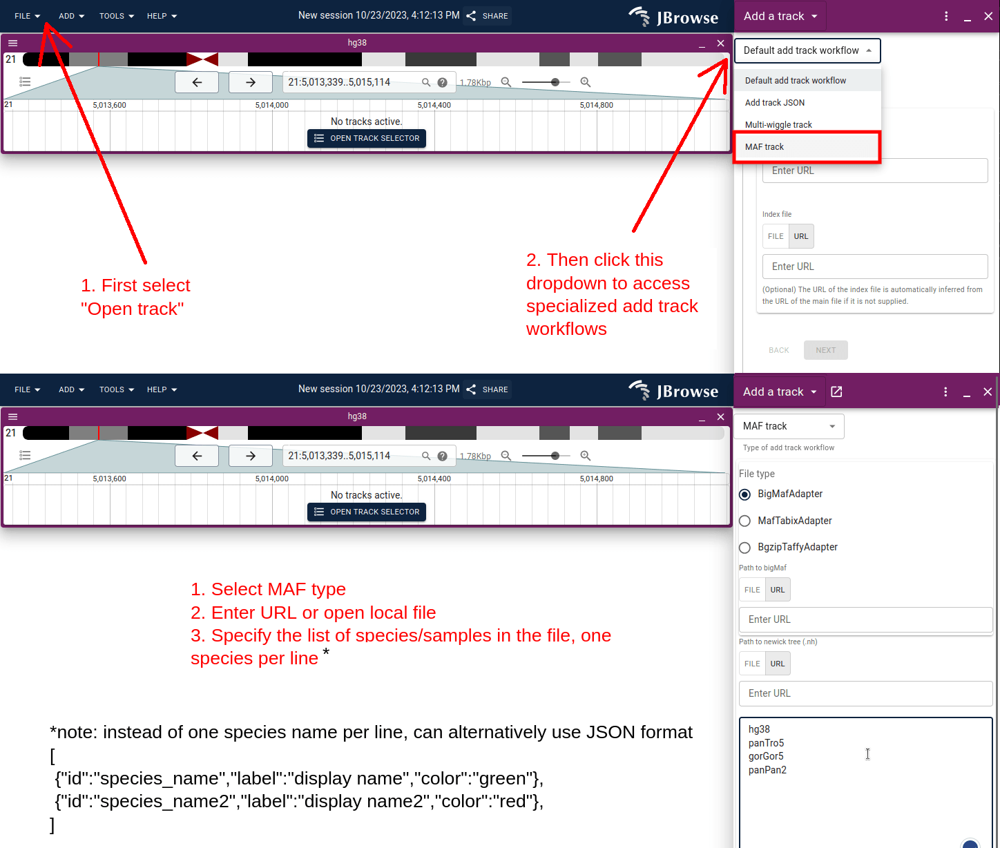

# jbrowse-plugin-mafviewer

A viewer for multiple alignment format (MAF) files in JBrowse 2

This is a port of the JBrowse 1 plugin https://github.com/cmdcolin/mafviewer to
JBrowse 2


## Demo

https://jbrowse.org/code/jb2/v2.7.1/?config=%2Fdemos%2Fmafviewer%2Fhg38%2Fconfig.json&session=share-O3sxhB3iS2&password=8Ysiv

## GUI usage (e.g. in JBrowse Desktop)

This short screenshot workflow shows how you can load your own custom MAF files
via the GUI



## Manual config entry

### Add plugin to your jbrowse 2 config.json

```json
{
  "plugins": [
    {
      "name": "MafViewer",
      "url": "https://unpkg.com/jbrowse-plugin-mafviewer/dist/jbrowse-plugin-mafviewer.umd.production.min.js"
    }
  ]
}
```

### Example MafTabixAdapter config

The MafTabix track is created according to

```json
{
  "type": "MafTrack",
  "trackId": "chrI.bed",
  "name": "chrI.bed",
  "adapter": {
    "type": "MafTabixAdapter",
    "samples": ["ce10", "cb4", "caeSp111", "caeRem4", "caeJap4", "caePb3"],
    "bedGzLocation": {
      "uri": "chrI.bed.gz"
    },
    "index": {
      "location": {
        "uri": "chrI.bed.gz.tbi"
      }
    }
  },
  "assemblyNames": ["c_elegans"]
}
```

### Example BigMafAdapter config

```json
{
  "type": "MafTrack",
  "trackId": "bigMaf",
  "name": "bigMaf (chr22_KI270731v1_random)",
  "adapter": {
    "type": "BigMafAdapter",
    "samples": [
      "hg38",
      "panTro4",
      "rheMac3",
      "mm10",
      "rn5",
      "canFam3",
      "monDom5"
    ],
    "bigBedLocation": {
      "uri": "bigMaf.bb"
    }
  },
  "assemblyNames": ["hg38"]
}
```

### Example with customized sample names and colors

```json
{
  "trackId": "MAF",
  "name": "example",
  "type": "MafTrack",
  "assemblyNames": ["hg38"],
  "adapter": {
    "type": "MafTabixAdapter",
    "bedGzLocation": {
      "uri": "data.txt.gz"
    },
    "index": {
      "location": {
        "uri": "data.txt.gz.tbi"
      }
    },
    "samples": [
      {
        "id": "hg38",
        "label": "Human",
        "color": "rgba(255,255,255,0.7)"
      },
      {
        "id": "panTro4",
        "label": "Chimp",
        "color": "rgba(255,0,0,0.7)"
      },
      {
        "id": "gorGor3",
        "label": "Gorilla",
        "color": "rgba(0,0,255,0.7)"
      },
      {
        "id": "ponAbe2",
        "label": "Orangutan",
        "color": "rgba(255,255,255,0.7)"
      }
    ]
  }
}
```

The samples array is either `string[]|{id:string,label:string,color?:string}[]`
